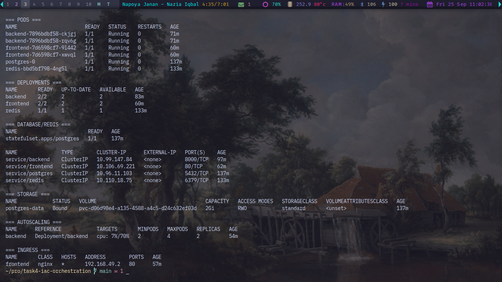
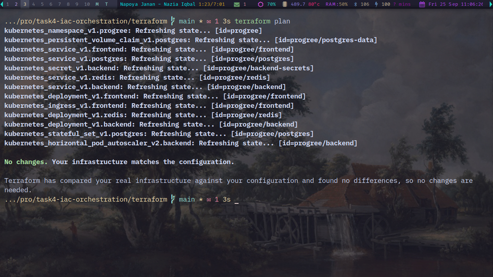
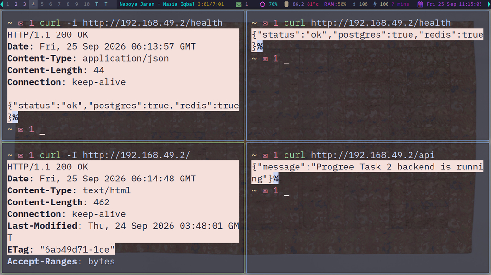
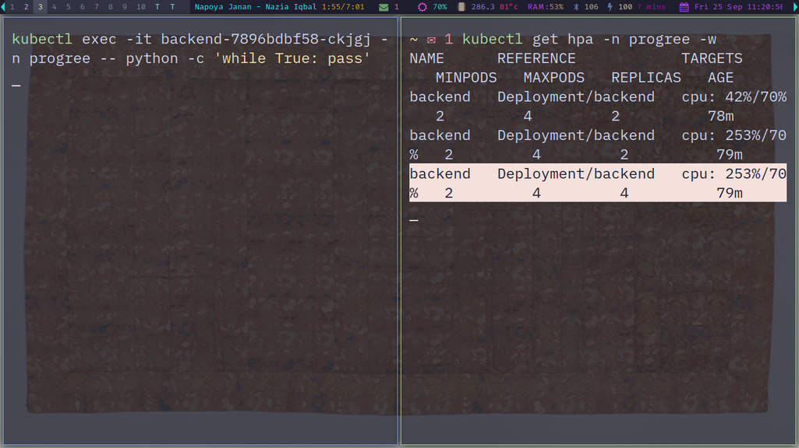
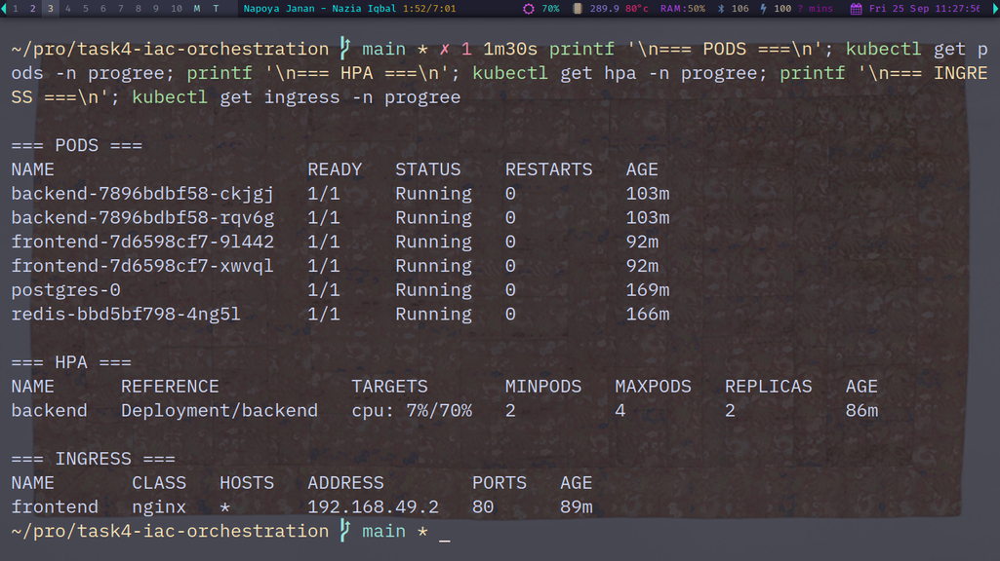

# Infrastructure as Code & Kubernetes Orchestration

Terraform-managed Kubernetes infrastructure for the Progree application, deployed locally with Minikube.

## Overview

This project provisions and manages the Progree application stack using Terraform and Kubernetes.

The infrastructure includes:

- PostgreSQL with persistent storage
- Redis
- Progree FastAPI backend
- Progree frontend served by Nginx
- Kubernetes Services for internal communication
- NGINX Ingress for external HTTP access
- Kubernetes Secret for the PostgreSQL password
- Horizontal Pod Autoscaler (HPA) for the backend
- CPU and memory resource requests and limits
- Terraform state management for the complete Kubernetes stack

## Architecture

```text
                         ┌──────────────────────┐
                         │      NGINX Ingress   │
                         │       HTTP :80       │
                         └──────────┬───────────┘
                                    │
                                    ▼
                         ┌──────────────────────┐
                         │   Frontend Service   │
                         │      ClusterIP :80   │
                         └──────────┬───────────┘
                                    │
                         ┌──────────▼───────────┐
                         │   Frontend Pods (2)  │
                         │        Nginx         │
                         └──────────┬───────────┘
                                    │
                         /api and /health proxy
                                    │
                                    ▼
                         ┌──────────────────────┐
                         │   Backend Service    │
                         │    ClusterIP :8000   │
                         └──────────┬───────────┘
                                    │
                         ┌──────────▼───────────┐
                         │    Backend Pods      │
                         │      FastAPI         │
                         │    2–4 replicas      │
                         └───────┬───────┬──────┘
                                 │       │
                    ┌────────────┘       └────────────┐
                    ▼                                 ▼
          ┌──────────────────┐              ┌──────────────────┐
          │ PostgreSQL       │              │ Redis            │
          │ StatefulSet      │              │ Deployment       │
          │ ClusterIP :5432  │              │ ClusterIP :6379  │
          │ Persistent 2 GiB │              └──────────────────┘
          └──────────────────┘
```

## Project Structure

```text
.
├── README.md
├── .gitignore
├── docs/
│   └── screenshots/
│       ├── scrot-1.jpg
│       ├── scrot-2.jpg
│       ├── scrot-3.jpg
│       ├── scrot-4.jpg
│       └── scrot-5.jpg
└── terraform/
    ├── main.tf
    ├── variables.tf
    └── terraform.tfvars        # local only, not committed
```

## Technologies

- Terraform
- Kubernetes
- Minikube
- Docker
- NGINX Ingress Controller
- FastAPI
- PostgreSQL
- Redis
- GitHub Container Registry

## Kubernetes Resources

Terraform manages the following resources in the `progree` namespace:

### PostgreSQL

- StatefulSet
- ClusterIP Service
- PersistentVolumeClaim
- 2 GiB persistent storage
- PostgreSQL 17 Alpine image

### Redis

- Deployment
- ClusterIP Service
- Redis 7 Alpine image

### Backend

- Deployment
- 2 replicas by default
- CPU requests/limits
- Memory requests/limits
- Readiness probe on `/health`
- Liveness probe on TCP port `8000`
- PostgreSQL Secret mounted at `/run/secrets/postgres_password`
- ServiceAccount token mounting disabled

### Frontend

- Deployment
- 2 replicas
- NGINX
- Readiness probe on `/health`
- Liveness probe on `/`
- ClusterIP Service on port `80`
- Service proxies `/api` and `/health` to the backend Service

### Ingress

- NGINX Ingress
- HTTP port `80`
- Routes traffic to the frontend Service

### Horizontal Pod Autoscaler

The backend HPA is configured with:

- Minimum replicas: `2`
- Maximum replicas: `4`
- CPU target: `70%`

Terraform ignores changes to the backend Deployment replica count so the HPA can manage scaling without Terraform reverting it.

## Prerequisites

Install and configure:

- Docker
- Minikube
- kubectl
- Terraform
- A working Kubernetes context

Start Minikube:

```bash
minikube start
```

Enable the required Minikube addons:

```bash
minikube addons enable ingress
minikube addons enable metrics-server
```

Verify the cluster:

```bash
kubectl get nodes
```

## Configure Terraform Variables

Create the local Terraform variable file:

```text
terraform/terraform.tfvars
```

Example:

```hcl
postgres_password = "change-this-local-password"
```

The file is intentionally ignored by Git.

Initialize Terraform:

```bash
cd terraform
terraform init
```

Validate the configuration:

```bash
terraform validate
```

Format the configuration:

```bash
terraform fmt
```

Review the execution plan:

```bash
terraform plan
```

Apply the infrastructure:

```bash
terraform apply
```

## Verify the Deployment

Check all resources:

```bash
kubectl get all,hpa,pvc,ingress -n progree
```

Expected healthy state:

- Backend: 2 replicas running
- Frontend: 2 replicas running
- PostgreSQL: 1 pod running
- Redis: 1 pod running
- PostgreSQL PVC: `Bound`
- Backend HPA: active
- Ingress: available

Check the backend health:

```bash
kubectl exec -n progree deployment/backend -- python -c 'import urllib.request; print(urllib.request.urlopen("http://127.0.0.1:8000/health").read().decode())'
```

Expected response:

```json
{"status":"ok","postgres":true,"redis":true}
```

Get the Minikube IP:

```bash
minikube ip
```

Test the frontend through Ingress:

```bash
curl http://<MINIKUBE_IP>/
```

Test the backend API through the frontend Ingress:

```bash
curl http://<MINIKUBE_IP>/api
```

Test the complete health path:

```bash
curl http://<MINIKUBE_IP>/health
```

Expected health response:

```json
{"status":"ok","postgres":true,"redis":true}
```

## Horizontal Pod Autoscaling Test

Check the current HPA status:

```bash
kubectl get hpa -n progree
```

The backend normally starts with 2 replicas.

To generate CPU load, run a CPU-intensive process inside a backend pod:

```bash
kubectl exec -it <BACKEND_POD> -n progree -- python -c 'while True: pass'
```

Monitor HPA behavior:

```bash
kubectl get hpa -n progree -w
```

During the test, the backend scaled from:

```text
2 replicas → 4 replicas
```

After the CPU load stopped, utilization dropped and the HPA returned the backend to its minimum of:

```text
2 replicas
```

## Terraform Drift Verification

The infrastructure is managed entirely through Terraform.

Run:

```bash
terraform plan
```

A clean deployment should report:

```text
No changes. Your infrastructure matches the configuration.
```

## Security Notes

The PostgreSQL password is supplied through a Terraform variable and stored locally in `terraform.tfvars`.

The following files are intentionally excluded from Git:

```text
*.tfvars
*.tfvars.json
```

The backend receives the password through a Kubernetes Secret and reads it from:

```text
/run/secrets/postgres_password
```

The backend does not require Kubernetes API credentials, so automatic ServiceAccount token mounting is disabled.

## Deployment Summary

This project demonstrates:

- Infrastructure as Code with Terraform
- Kubernetes workload orchestration
- Stateful PostgreSQL deployment with persistent storage
- Redis deployment
- Multi-replica application workloads
- Kubernetes Services and service discovery
- Secret management
- Liveness and readiness probes
- NGINX Ingress routing
- Resource requests and limits
- Horizontal Pod Autoscaling
- Terraform and HPA coexistence
- Infrastructure drift verification

## Verification Evidence

The following screenshots document the completed Kubernetes deployment and validation.

### 1. Kubernetes Infrastructure

Shows the healthy Progree Kubernetes workloads, Services, PostgreSQL persistent storage, HPA, and NGINX Ingress.



### 2. Terraform Drift Verification

Shows Terraform reporting that the deployed infrastructure matches the configuration with no pending changes.



### 3. End-to-End Application Verification

Shows successful frontend access, backend API access, and application health through the NGINX Ingress, including healthy PostgreSQL and Redis connectivity.



### 4. Horizontal Pod Autoscaling

Shows the backend scaling from 2 to 4 replicas when CPU utilization exceeded the configured 70% target.



### 5. Final Healthy State

Shows the application returning to its normal 2 backend replicas after the autoscaling test, with the complete stack healthy.



## Repository

GitHub:

https://github.com/Awan/progree-task-4-iac-orchestration
